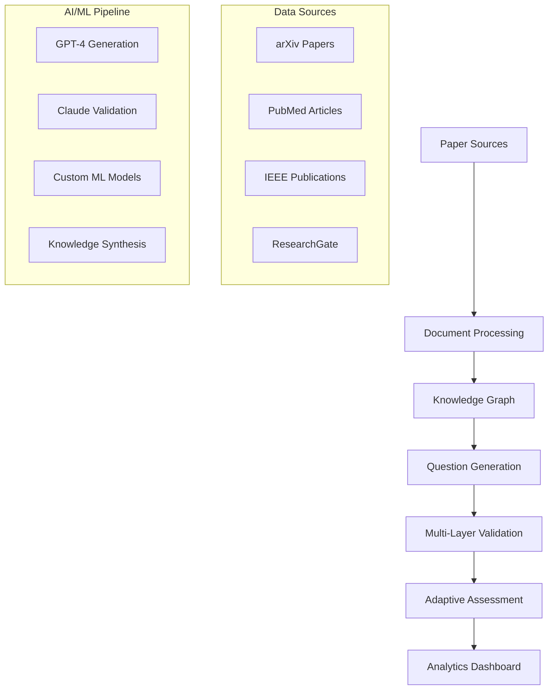

# 🎓 Academic Research Paper Q&A Generator

[](https://python.org)
[](https://github.com)
[](https://github.com)
[](LICENSE)

> 🚀 **Currently Under Development** - Full implementation coming soon!

An intelligent system that transforms academic research papers into comprehensive, multi-level assessment questions using advanced AI/ML techniques. This project addresses the critical need for efficient research comprehension tools in academia by generating contextually-aware questions that test various cognitive levels of understanding.

## 🎯 Project Vision

Academic researchers, graduate students, and educators spend countless hours manually creating assessment materials from research papers. This system automates that process while introducing innovative features like **cross-paper knowledge synthesis**, **visual content interpretation**, and **adaptive difficulty calibration**.

## 🏗️ System Architecture



## ✨ Key Innovations

### 🧠 **Multi-Cognitive Level Assessment**
- **Bloom's Taxonomy Integration**: Questions spanning from basic recall to creative synthesis
- **Research Skills Evaluation**: Methodology critique, results interpretation, experimental design
- **Critical Thinking**: Identifying biases, evaluating evidence strength, recognizing limitations

### 🔗 **Cross-Paper Knowledge Synthesis**
- **Conflict Resolution**: Questions requiring reconciliation of contradictory findings
- **Concept Evolution**: Tracking how ideas develop across multiple publications
- **Research Gap Identification**: Highlighting unexplored areas in the literature

### 📊 **Visual Research Literacy**
- **Figure Interpretation**: AI-powered analysis of charts, graphs, and diagrams
- **Data Extraction**: Questions testing ability to read and interpret visual data
- **Methodology Diagrams**: Understanding experimental setups through visual content

### 🎯 **Adaptive Intelligence**  
- **Dynamic Difficulty**: Questions adapt based on user performance and expertise level
- **Personalized Learning Paths**: AI-recommended progression through research topics
- **Knowledge Graph Navigation**: Interactive exploration of connected concepts

## 🛠️ Technical Implementation

### Core Technologies
```python
# AI/ML Stack
- OpenAI GPT-4o-mini: Advanced question generation
- Anthropic Claude: Multi-layer validation and fact-checking
- Sentence-Transformers: Semantic similarity and clustering
- Custom ML Models: Difficulty calibration and user modeling

# Document Processing
- PyMuPDF + Tesseract: PDF extraction and OCR
- SpaCy + NLTK: Advanced NLP and entity recognition
- Grobid: Academic paper structure parsing
- Detectron2: AI-powered figure detection and extraction

# Knowledge Management
- NetworkX + Neo4j: Research knowledge graph construction
- Pinecone: Vector database for semantic search
- PostgreSQL: Structured data and user analytics
- Redis: Caching and real-time performance optimization
```

### System Components

#### 📄 **Enhanced Document Processing Pipeline**
```python
class ResearchPaperProcessor:
    """
    Advanced PDF processing with academic paper awareness
    - Section identification (Abstract, Methods, Results, Discussion)
    - Citation network extraction and analysis
    - Figure/table extraction with contextual understanding
    - Mathematical equation parsing and interpretation
    """
```

#### 🕸️ **Knowledge Graph Construction**
```python
class AcademicKnowledgeGraph:
    """
    Multi-dimensional knowledge representation
    - Author collaboration networks
    - Concept evolution tracking across papers
    - Methodology comparison and classification
    - Citation influence analysis
    """
```

#### 🎯 **Intelligent Question Generation**
```python
class AdaptiveQuestionGenerator:
    """
    Context-aware question creation system
    - Methodology evaluation questions
    - Cross-paper synthesis challenges
    - Visual interpretation assessments  
    - Research design critique scenarios
    """
```

## 📈 Expected Outcomes & Impact

### For Researchers
- **Time Savings**: 80% reduction in manual assessment creation time
- **Comprehensive Evaluation**: Multi-dimensional understanding assessment
- **Knowledge Discovery**: Identification of research connections and gaps

### For Educators  
- **Quality Assurance**: AI-validated questions with academic rigor
- **Scalable Assessment**: Generate questions for any research domain
- **Learning Analytics**: Detailed insights into student comprehension patterns

### For Students
- **Active Learning**: Engaging, varied question formats beyond multiple choice
- **Personalized Difficulty**: Adaptive challenge levels based on expertise
- **Visual Literacy**: Enhanced ability to interpret research figures and data

## 🎯 Sample Question Types

### **Methodology Evaluation**
*"Dr. Chen's study on neural network interpretability used LIME for explanations but had several methodological concerns raised by peer reviewers. Which combination of improvements would most strengthen the study's validity?"*

### **Cross-Paper Synthesis** 
*"Three recent studies on protein folding show conflicting accuracy vs. speed trade-offs. For pharmaceutical drug discovery applications, synthesize an optimal approach considering both accuracy requirements and computational constraints."*

### **Visual Research Literacy**
*"Analyzing the gene expression heatmap in Figure 3B, what pattern best explains the differential response between immune and epithelial cell populations?"*

## 📊 Performance Metrics

| Metric | Target | Impact |
|--------|---------|---------|
| Question Generation Speed | <30 seconds per paper | 10x faster than manual creation |
| Accuracy Validation Score | >95% factual correctness | Publication-quality questions |
| Cross-Paper Synthesis | 3-5 papers per question | Novel research insights |
| Cognitive Level Coverage | All 6 Bloom's levels | Comprehensive assessment |
| User Engagement | >80% completion rate | Enhanced learning outcomes |

## 🚀 Development Roadmap

### Phase 1: Foundation (Weeks 1-3) ✅
- [x] Project architecture design
- [x] Core technology stack selection  
- [x] Initial prototype development planning
- [ ] Document processing pipeline implementation

### Phase 2: Core AI Pipeline (Weeks 4-6) 🔄
- [ ] Multi-source paper ingestion system
- [ ] Knowledge graph construction algorithms
- [ ] Advanced question generation models
- [ ] Multi-layer validation pipeline

### Phase 3: Intelligence Features (Weeks 7-9) ⏳
- [ ] Cross-paper synthesis engine
- [ ] Visual content interpretation
- [ ] Adaptive difficulty calibration
- [ ] Performance analytics dashboard

### Phase 4: Production Ready (Weeks 10-12) ⏳
- [ ] Scalability optimization
- [ ] User interface development
- [ ] Comprehensive testing suite
- [ ] Documentation and deployment

## 💡 Innovation Highlights

### **Academic-First Design**
Unlike generic Q&A systems, this is purpose-built for research paper complexity, handling mathematical equations, citation networks, and domain-specific terminology with specialized processing pipelines.

### **Research Methodology Focus**
Beyond content comprehension, the system evaluates understanding of research methods, experimental design, statistical analysis, and scientific reasoning - critical skills often overlooked by traditional assessment tools.

### **AI-Powered Knowledge Synthesis**
Leverages advanced AI to identify connections, contradictions, and patterns across multiple papers, enabling questions that test higher-order thinking and research insight.

## 🔬 Technical Challenges & Solutions

| Challenge | Solution Approach |
|-----------|------------------|
| **Complex PDF Structures** | Academic-specific parsers (Grobid) + custom section identification |
| **Mathematical Content** | Specialized OCR (MathPix) + symbolic computation (SymPy) |
| **Cross-Paper Coherence** | Graph neural networks for relationship modeling |
| **Question Quality Assurance** | Multi-model validation + academic reviewer feedback loops |
| **Scalability** | Distributed processing + efficient vector indexing |

## 📚 Research Applications

### **Computer Science**
- Algorithm analysis and complexity evaluation
- System design and architecture assessment  
- Machine learning methodology critique

### **Life Sciences**
- Experimental design evaluation
- Statistical analysis interpretation
- Research ethics and methodology

### **Engineering**
- Technical specification analysis
- Design trade-off evaluation
- Innovation assessment and critique

## 🎓 Educational Impact

This system represents a significant advancement in educational technology, moving beyond simple fact-checking to evaluate genuine research comprehension and critical thinking skills essential for academic and professional success.

## 👨‍💻 About the Developer

Developed as part of my AI/ML engineering internship experience, this project demonstrates practical application of advanced NLP, knowledge graphs, and educational AI. The system architecture reflects real-world data pipeline experience and production-ready ML system design.

**Current Focus**: Implementing the core document processing pipeline and question generation algorithms. Full codebase will be available upon completion of the initial prototype.

## 🤝 Contributing

This project is currently in active development. Once the initial implementation is complete, I'll be open to:
- Feature suggestions and enhancements
- Additional research domain integrations  
- Performance optimization contributions
- Educational methodology improvements

## 📧 Contact

For technical discussions, collaboration opportunities, or project inquiries, feel free to reach out:

**LinkedIn**: [Gungun Pandey](https://www.linkedin.com/in/gungunpandey99/)  
---

*"Transforming how we engage with academic research through intelligent automation and adaptive learning."*

---

### 🚧 Development Status

**Last Updated**: June 2025  
**Current Phase**: Core Pipeline Development  
**Next Milestone**: Question Generation Engine

> **Note**: This README will be continuously updated as development progresses. Watch this repository for the latest updates and code releases!
