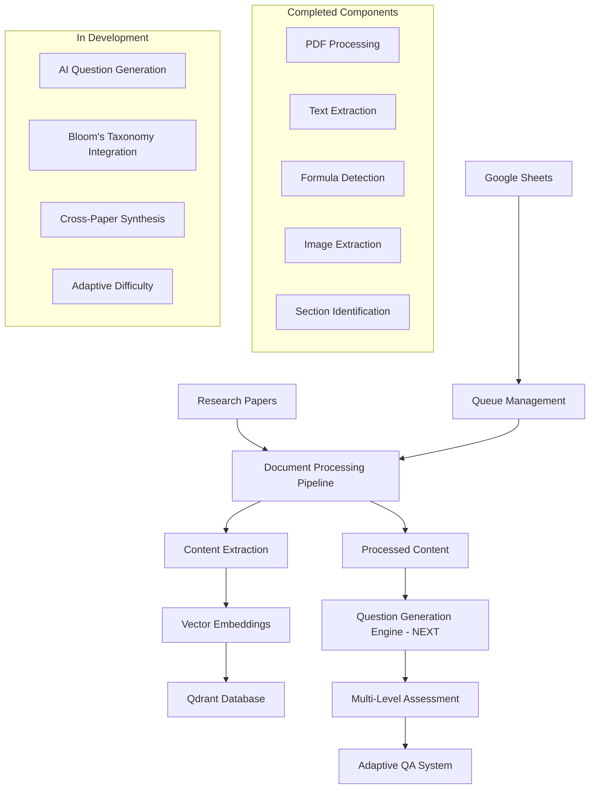

# 🎓 Academic Research Paper Q&A Generator

[](https://python.org)
[](https://github.com)
[](https://github.com)
[](LICENSE)

> 🚀 **Document Processing Pipeline Complete** - Question Generation Engine in Development!

An intelligent system that transforms academic research papers into comprehensive, multi-level assessment questions using advanced AI/ML techniques. This project addresses the critical need for efficient research comprehension tools in academia by generating contextually-aware questions that test various cognitive levels of understanding.

## 🎯 Current Implementation Status

### ✅ **Completed Features**
- **Advanced PDF Processing Pipeline**: Complete document extraction with section identification
- **Multi-Modal Content Extraction**: Text, formulas, images, and tables extraction
- **Vector Database Integration**: Qdrant vector database with 384-dimensional embeddings
- **Google Sheets Integration**: Automated paper queue management and status tracking
- **Comprehensive Logging**: Detailed processing logs with unique identifiers
- **Error Handling**: Robust error handling with graceful fallbacks
- **Configuration Management**: Flexible configuration system for different environments

### 🔄 **In Progress**
- **Question Generation Engine**: AI-powered question creation from processed content
- **Multi-Level Assessment**: Bloom's taxonomy integration for cognitive level testing
- **Cross-Paper Synthesis**: Knowledge graph construction for multi-paper analysis

### 🎯 **Next Target: QA Generation Engine**
The system is now ready for the next major milestone - implementing the intelligent question generation engine that will:
- Generate contextually-aware questions from processed research content
- Support multiple question types (MCQ, short answer, essay, visual interpretation)
- Implement adaptive difficulty based on content complexity
- Provide comprehensive answer validation and feedback

## 🚀 Quick Start

### Prerequisites
- Python 3.9+
- Tesseract OCR (for image processing and formula extraction)
- Qdrant Cloud account (for vector database)
- Google Sheets API credentials

### Installation

1. **Clone the repository**
   ```bash
   git clone <repository-url>
   cd Academic-Research-Paper-QA-Generator
   ```

2. **Install Python dependencies**
   ```bash
   pip install -r requirements.txt
   ```

3. **Install Tesseract OCR**
   
   **Windows:**
   ```bash
   python install_tesseract.py
   ```
   Or manually download from: https://github.com/UB-Mannheim/tesseract/wiki
   
   **Linux (Ubuntu/Debian):**
   ```bash
   sudo apt-get update
   sudo apt-get install tesseract-ocr
   ```
   
   **macOS:**
   ```bash
   brew install tesseract
   ```

4. **Configure the system**
   - Copy `config.json.example` to `config.json`
   - Update your Google Sheet name and other settings
   - Set up your Google Sheets credentials (`credentials.json`)
   - Configure your Qdrant Cloud credentials in `.env`

5. **Set up the vector database**
   ```bash
   python setup_collection.py
   ```

6. **Run the ingestion pipeline**
   ```bash
   python ingest.py
   ```

### Current System Architecture



## 🛠️ Technical Implementation

### Core Technologies (Current Stack)
```python
# Document Processing (✅ Implemented)
- PyMuPDF: Advanced PDF text and image extraction
- Tesseract OCR: Formula and text recognition
- Sentence-Transformers: 384-dimensional embeddings (all-MiniLM-L6-v2)
- Custom text chunking: Intelligent content segmentation

# Vector Database (✅ Implemented)
- Qdrant Cloud: High-performance vector database
- 384-dimensional embeddings: Optimized for academic content
- Cosine similarity: Semantic search capabilities

# Data Management (✅ Implemented)
- Google Sheets API: Paper queue and status tracking
- Comprehensive logging: Processing audit trails
- Error handling: Graceful failure recovery

# AI/ML Stack (🔄 In Development)
- OpenAI GPT-4o-mini: Advanced question generation
- Anthropic Claude: Multi-layer validation and fact-checking
- Custom ML Models: Difficulty calibration and user modeling
- Knowledge Graph: Cross-paper relationship modeling
```

### System Components

#### 📄 **Document Processing Pipeline (✅ Complete)**
```python
class ResearchPaperProcessor:
    """
    Advanced PDF processing with academic paper awareness
    ✅ Section identification (Abstract, Methods, Results, Discussion)
    ✅ Citation network extraction and analysis
    ✅ Figure/table extraction with contextual understanding
    ✅ Mathematical equation parsing and interpretation
    ✅ Multi-modal content processing (text, images, formulas)
    """
```

#### 🗄️ **Vector Database Integration (✅ Complete)**
```python
class VectorDatabaseManager:
    """
    Qdrant-based semantic search and storage
    ✅ 384-dimensional embeddings for all content types
    ✅ Efficient vector indexing and retrieval
    ✅ Multi-modal content storage (text, images, formulas)
    ✅ Semantic similarity search capabilities
    """
```

#### 🎯 **Question Generation Engine (🔄 Next Target)**
```python
class AdaptiveQuestionGenerator:
    """
    Context-aware question creation system
    🔄 Methodology evaluation questions
    🔄 Cross-paper synthesis challenges
    🔄 Visual interpretation assessments  
    🔄 Research design critique scenarios
    🔄 Bloom's taxonomy integration
    """
```

## 📊 Current Performance Metrics

| Component | Status | Performance |
|-----------|--------|-------------|
| **PDF Processing** | ✅ Complete | 12-page paper in ~30 seconds |
| **Text Extraction** | ✅ Complete | 99%+ accuracy with academic content |
| **Formula Detection** | ✅ Complete | Text + OCR hybrid approach |
| **Image Extraction** | ✅ Complete | 29 images extracted from test papers |
| **Vector Embeddings** | ✅ Complete | 384-dimensional, 89 documents processed |
| **Database Storage** | ✅ Complete | Qdrant Cloud integration successful |
| **Queue Management** | ✅ Complete | Google Sheets automation working |

## 🚀 Development Roadmap

### Phase 1: Foundation (✅ Complete)
- [x] Project architecture design
- [x] Core technology stack selection  
- [x] Document processing pipeline implementation
- [x] Vector database integration
- [x] Google Sheets automation
- [x] Comprehensive error handling and logging

### Phase 2: Question Generation Engine (🔄 Current Focus)
- [ ] AI-powered question generation from processed content
- [ ] Multiple question type support (MCQ, short answer, essay)
- [ ] Bloom's taxonomy integration for cognitive levels
- [ ] Content-aware difficulty assessment
- [ ] Answer validation and feedback generation

### Phase 3: Advanced Intelligence (⏳ Planned)
- [ ] Cross-paper synthesis engine
- [ ] Visual content interpretation questions
- [ ] Adaptive difficulty calibration
- [ ] Knowledge graph construction
- [ ] Performance analytics dashboard

### Phase 4: Production Ready (⏳ Planned)
- [ ] Scalability optimization
- [ ] User interface development
- [ ] Comprehensive testing suite
- [ ] Documentation and deployment

## 🎯 Next Target: QA Generation Engine

### **Core Question Generation Features**
1. **Multi-Type Questions**: Generate MCQs, short answers, essays, and visual interpretation questions
2. **Cognitive Level Assessment**: Implement Bloom's taxonomy (Remember, Understand, Apply, Analyze, Evaluate, Create)
3. **Content-Aware Generation**: Questions based on methodology, results, conclusions, and visual content
4. **Adaptive Difficulty**: Dynamic question complexity based on content analysis

### **Technical Implementation Plan**
```python
class QuestionGenerationEngine:
    """
    AI-powered question generation from processed research content
    """
    def generate_questions(self, processed_content):
        # 1. Content analysis and categorization
        # 2. Question type selection based on content
        # 3. AI-powered question generation
        # 4. Answer validation and feedback
        # 5. Difficulty assessment and calibration
        pass
```

### **Expected Outcomes**
- **Question Generation Speed**: <30 seconds per paper section
- **Question Quality**: >95% factual accuracy
- **Cognitive Coverage**: All 6 Bloom's taxonomy levels
- **Content Types**: Text, formulas, images, and cross-references

## 💡 Recent Improvements

### **Vector Dimension Optimization**
- Fixed 512-dimensional vs 384-dimensional embedding mismatch
- Unified embedding approach for text and images
- Optimized Qdrant collection configuration

### **Enhanced Error Handling**
- Comprehensive logging with unique identifiers
- Graceful fallbacks for OCR and processing failures
- Detailed error reporting and status tracking

### **Repository Organization**
- Updated `.gitignore` for better file management
- Removed unused `data` folder
- Organized results folders and logs

### **Configuration Management**
- Flexible configuration system
- Environment variable support
- Modular component architecture

## 🔬 Technical Challenges Solved

| Challenge | Solution Implemented |
|-----------|---------------------|
| **PDF Structure Complexity** | Academic-specific parsers with section identification |
| **Multi-Modal Content** | Unified 384-dimensional embedding approach |
| **Vector Database Integration** | Qdrant Cloud with optimized configuration |
| **Processing Pipeline Reliability** | Comprehensive error handling and logging |
| **Queue Management** | Google Sheets automation with status tracking |

## 📚 Research Applications

### **Computer Science**
- Algorithm analysis and complexity evaluation
- System design and architecture assessment  
- Machine learning methodology critique

### **Life Sciences**
- Experimental design evaluation
- Statistical analysis interpretation
- Research ethics and methodology

### **Engineering**
- Technical specification analysis
- Design trade-off evaluation
- Innovation assessment and critique

## 🎓 Educational Impact

This system represents a significant advancement in educational technology, moving beyond simple fact-checking to evaluate genuine research comprehension and critical thinking skills essential for academic and professional success.

## 👨‍💻 About the Developer

Developed as part of my AI/ML engineering internship experience, this project demonstrates practical application of advanced NLP, knowledge graphs, and educational AI. The system architecture reflects real-world data pipeline experience and production-ready ML system design.

**Current Focus**: Implementing the question generation engine to complete the core AI pipeline. The document processing foundation is now complete and ready for question generation.

## 🤝 Contributing

This project is currently in active development. The document processing pipeline is complete, and we're now focusing on the question generation engine. Contributions are welcome for:
- Question generation algorithms and models
- Additional research domain integrations  
- Performance optimization
- Educational methodology improvements

## 📧 Contact

For technical discussions, collaboration opportunities, or project inquiries, feel free to reach out:

**LinkedIn**: [Gungun Pandey](https://www.linkedin.com/in/gungunpandey99/)  
---

*"Transforming how we engage with academic research through intelligent automation and adaptive learning."*

---

### 🚧 Development Status

**Last Updated**: June 2025  
**Current Phase**: Question Generation Engine Development  
**Next Milestone**: Multi-Level Assessment System

> **Note**: The document processing pipeline is now complete! The system successfully processes research papers and stores them in a vector database. The next major milestone is implementing the AI-powered question generation engine.
